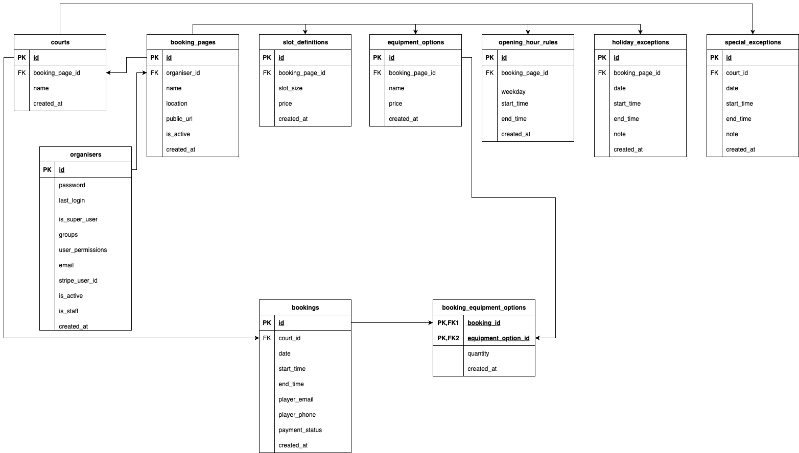

# Tennislot, launch your tennis court bookings - in minutes, with no upfront costs.

## Target User & Problem

Local tennis court owners often struggle with managing reservations manually. However, they are reluctant to adopt online systems because most solutions are either too complex or too costly.

## Solution

Tennislot enables tennis court owners to set up an online booking page in minutes, with no upfront costs and only a small transaction fee per booking.

## Features

- ⚡ Step-by-step wizard for organisers to create customised booking pages  
- 🎾 Public booking pages for players to book courts and pay online 
- 💳 Stripe Checkout integration for secure payments 
- 🔗 Stripe Connect integration for automatic transaction fee collection 
- ☁️ Deployable to Render

## Data Model

## Tech Stack

### Frontend
- Django Templates
- Tailwind CSS
- Vanilla JS
- HTMX

### Backend
- Django
- Django ORM
- Django Forms
- Django Allauth

### Database
- PostgreSQL

### Payment Service
- Stripe Checkout
- Stripe Connect Standard
- Stripe Webhooks

### DevOps / Hosting
- GitHub
- Render